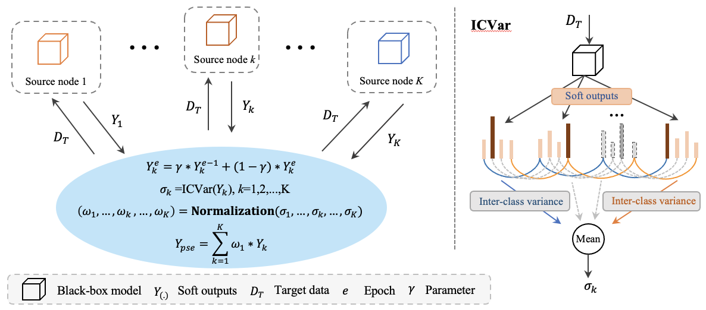

# Co-MDA: Federated Multi-source Domain Adaptation on Black-box Models

Here is the implementation of the model Co-MDA in paper: Co-MDA: Federated Multi-source Domain Adaptation on Black-box Models.
 

## Model Review:


## Setup

**Install Package Dependencies**

```shell
Python Environment == 3.7 
torch == 1.3.1
torchvision == 0.4.2
tensorboard == 2.4.1
tensorboardX == 2.0
numpy
yaml
```

**Install Datasets**

We need users to declare a base path to store the dataset as well as the log of training procedure. The directory structure should be

```
base_path
│       
└───dataset
│   │   DigitFive
│       │   mnist_data.mat
│       │   mnistm_with_label.mat
|       |   svhn_train_32x32.mat  
│       │   ...
│   │   DomainNet
│       │   ...
│   │   OfficeCaltech10
│       │   ...
|   |   OfficeHome
```
Our framework now support four multi-source domain adaptation datasets: ```DigitFive, DomainNet, OfficeCaltech10 and OfficeHome```.

**Dataset Preparation**

*DigitFive:*
The DigitFive dataset can be accessed in [DigitFive](https://drive.google.com/file/d/1QvC6mDVN25VArmTuSHqgd7Cf9CoiHvVt/view).

*OfficeHome:*
The OfficeCaltech10 dataset can be accessed in [OfficeHome](https://www.hemanthdv.org/officeHomeDataset.html).

*DomainNet:*
The DomainNet dataset can be accessed in [DomainNet](http://ai.bu.edu/M3SDA/).
  
**Training**  
The configuration files can be found under the folder `./config`, and we provide four config files with the format `.yaml`. To perform the Federated Multi-source Domain Adaptation on Black-Box Models on the specific dataset (e.g., DigitFive), please use the following commands:
 
```python
python main.py --config DigitFive.yaml --target-domain mnistm -bp base_path -forget_rate 0.4
python main.py --config DigitFive.yaml --target-domain mnist -bp base_path -forget_rate 0.04
python main.py --config DigitFive.yaml --target-domain svhn -bp base_path -forget_rate 0.08
```
